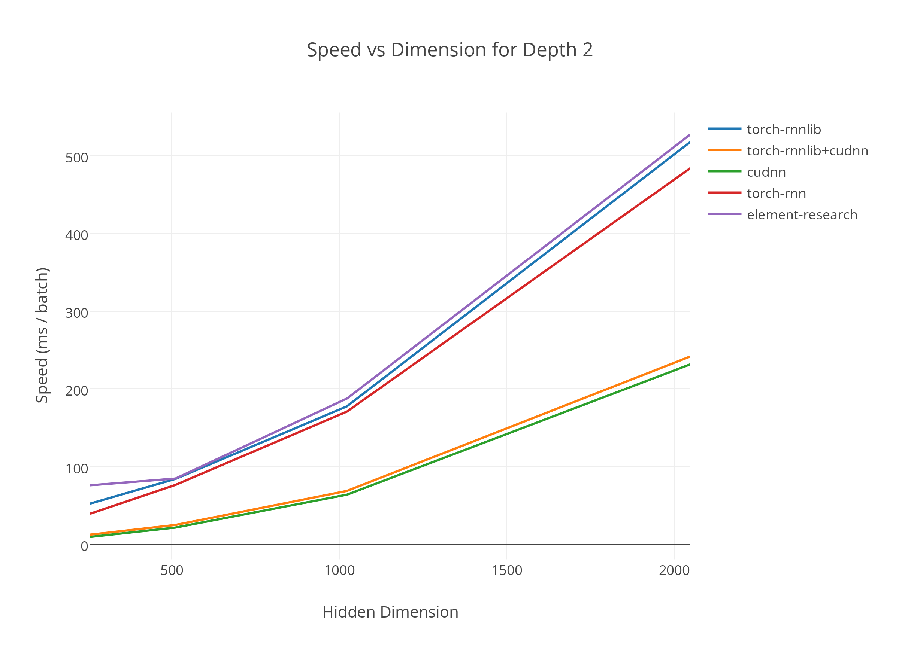

# torch-rnnlib

torch-rnnlib is a library for modeling sequential data within Torch7's NN framework.

## Installation

Run `luarocks make rocks/rnnlib-0.1-1.rockspec`.

### Core dependencies
- [torch7](https://github.com/torch/torch7)
- [argcheck](https://github.com/torch/argcheck)
- [nn](https://github.com/torch/nn)
- [nngraph](https://github.com/torch/nngraph)

### Dependencies for running on GPU(s)
- [cutorch](https://github.com/torch/cutorch)
- [cunn](https://github.com/torch/cunn)
- [cudnn](https://github.com/soumith/cudnn.torch)

### Dependencies for running the examples
- [penlight](https://github.com/stevedonovan/Penlight)
- [torch-tds](https://github.com/torch/tds)
- [torch-sys](https://github.com/torch/sys)

### Dependencies for building the documentation
- [paths](https://github.com/torch/paths)

## Usage

### Construct the model

We give three different APIs for constructing a network with recurrent connections. The first two give access to cudnn bindings as well. The purpose of this is to allow easy usage of the torch.cudnn RNN bindings for quick baselines.

1\. The nn.{RNN, LSTM, GRU} interface can be used to construct recurrent networks with the same number of hidden units across all layers.
```lua
local rnnlib = require 'rnnlib'
local lstm = nn.LSTM{ inputsize = 256, hidsize = 512, nlayer = 3, usecudnn = false }
```
2\. The rnnlib.recurrentnetwork interface can be used to construct recurrent networks with any shape. Both the previous and this interface take care of hidden state saving for you.
```lua
local rnnlib = require 'rnnlib'
local lstm   = rnnlib.makeRecurrent{
    cellfn    = rnnlib.cell.LSTM,
    inputsize = 256,
    hids      = { 512, 512 },
}
```
There is also a Cudnn wrapper for this level.
```lua
local rnnlib = require 'rnnlib'
local lstm   = rnnlib.makeCudnnRecurrent{
    cellstring = 'LSTM',
    inputsize  = 256,
    hids       = { 512, 512 },
}
```
3\. The nn.SequenceTable interface can be used to chain computations as a 'scan' would. The nn.RecurrentTable constructor is simply a lightweight wrapper that clones the recurrent module over time for you. However, do take note that this is the lowest-level interface and you will have to call `rnnlib.setupRecurrent(model, initializationfunctions)` in order to setup the recurrent hidden state behaviour.
```lua
local rnnlib = require 'rnnlib'

-- The table of cells is fed to each level of the recurrent network to construct each layer.
-- The table of initialization functions helps with the construction of the hidden inputs.
local cells, initfunctions = {}, {}
cells[1], initfunctions[1] = rnnlib.cell.LSTM(256, 512)
cells[2], initfunctions[2] = rnnlib.cell.LSTM(512, 512)
cells[3], initfunctions[3] = rnnlib.cell.LSTM(512, 512)

local lstm = nn.SequenceTable{
    dim = 1,
    modules = {
        nn.RecurrentTable{ dim = 2, module = rnnlib.cell.gModule(cells[1]) },
        nn.RecurrentTable{ dim = 2, module = rnnlib.cell.gModule(cells[2]) },
        nn.RecurrentTable{ dim = 2, module = rnnlib.cell.gModule(cells[3]) },
    },
}

rnnlib.setupRecurrent(lstm, initfunctions)
```

### Train the model

All the modules in this library adhere to the `nn.Container` or `nn.Module` API.

Given a recurrent network constructed in one of the above ways, you can use a lookup table and linear layer to train it as follows:

```lua
local mutils    = require 'rnnlib.mutils'
-- The vocabulary size.
local vocabsize = 10000
-- The dimensionality of the last hidden layer.
local lasthid   = 512
-- The dimensionality of the input embeddings.
local insize    = 256
-- The sequence length.
local seqlen    = 32
-- The batch size.
local bsz       = 32
-- The lookup table.
local lut       = nn.LookupTable(vocabsize, insize)
-- The decoder.
local decoder   = nn.Linear(lasthid, vocabsize)
-- The full model.
local model     = nn.Sequential()
    :add(mutils.batchedinmodule(lstm, lut))
    :add(nn.SelectTable(2))
    :add(nn.SelectTable(-1))
    :add(nn.JoinTable(1))
    :add(decoder)
model:cuda()
-- This returns a flattened view of the output tensor.
-- If you want this to be of a different shape, you can add an nn.View at the end.

-- Generate the input to the model.
local input = torch.range(1, seqlen * bsz)
    :resize(seqlen, bsz)
    :cudaLong()

-- Create and initialize hiddens to zero.
lstm:initializeHidden(bsz)

-- Perform the forward pass.
local output = model:forward{ lstm.hiddenbuffer, input }
-- This is just an example, normally you would not use the output as the gradOutput.
-- But the gradOutput should have the same shape as the model output.
model:backward({ lstm.hiddenbuffer, input }, output)
model:updateParameters(0.1)
```

## Benchmarks

We benchmark against the good work done in similar RNN libraries,
[rnn](https://github.com/Element-Research/rnn) and [torch-rnn](https://github.com/jcjohnson/torch-rnn),
on the Penn Tree Bank dataset with an LSTM language model with hidden dimensions of 256, 512, 1024, 2048, and 4096.
All models have a sequence length of 50, a batch size of 64, 2 layers, and were averaged over 1000 iterations.



## Join the community
See the CONTRIBUTING file for how to help out.

## License
torch-rnnlib is BSD-licensed. We also provide an additional patent grant.
